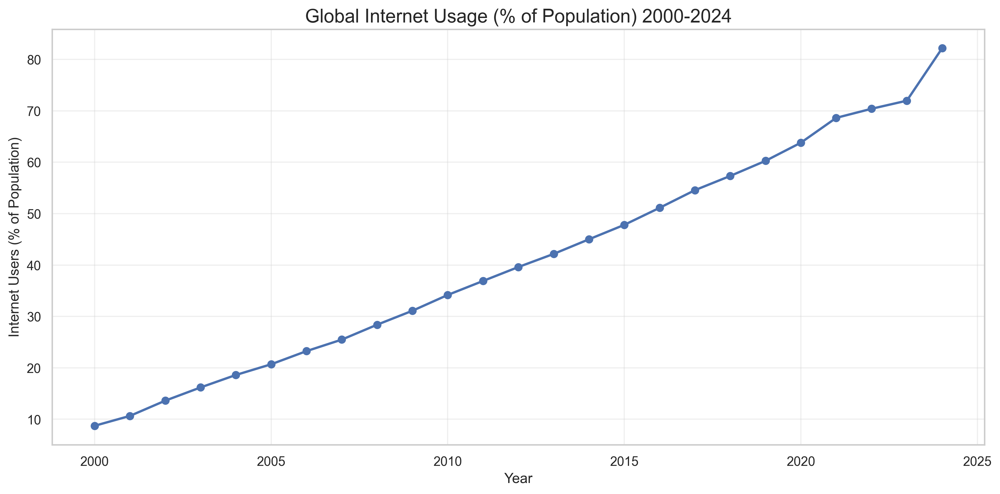

# Global Connectivity Trends (2000-2024)

## Project Overview

This analytics engineering portfolio project analyzes global trends in household connectivity (fixed-line and mobile) from 2000 to 2024. The project demonstrates a full-stack data engineering workflow, from API data extraction to transformation, analysis, and visualization.

### Data Source

The data is sourced from the WorldBank Data360 API, specifically the "Percentage of households with fixed-line or mobile" dataset from the ITU_DH collection.

### Skills Demonstrated

- **Data Engineering**: API integration, ETL pipeline development, data cleaning
- **Analytics Engineering**: dbt modeling, incremental loading, data transformation
- **Data Analysis**: Exploratory data analysis, statistical analysis, trend identification
- **Data Visualization**: Time series visualization, comparative analysis
- **DevOps**: CI/CD pipeline with GitHub Actions, automated data refresh
- **Software Engineering**: Python, SQL, version control, documentation

## Pipeline Architecture

```
┌─────────────┐     ┌─────────────┐     ┌─────────────┐     ┌─────────────┐
│  WorldBank  │     │    Data     │     │     dbt     │     │ Exploratory │
│  Data360    │ ──> │  Cleaning   │ ──> │   Models    │ ──> │    Data     │
│     API     │     │  Pipeline   │     │             │     │  Analysis   │
└─────────────┘     └─────────────┘     └─────────────┘     └─────────────┘
                                                                   │
                                                                   ▼
                                                           ┌─────────────┐
                                                           │ Visualiza-  │
                                                           │    tions    │
                                                           └─────────────┘
```

## Key Findings

### Summary Statistics

- **Time Period**: 2000 - 2024
- **Global Average Connectivity**: Increasing trend over the analyzed period
- **Regional Disparities**: Significant differences between developed and developing regions

### Top Countries by Connectivity Percentage

The analysis reveals that Nordic and Western European countries typically lead in connectivity rates, with countries like South Korea and Japan also showing strong performance.

### Namibia Analysis

Special focus was given to Namibia's connectivity trends, comparing them against global and regional averages to identify growth patterns and potential areas for improvement.

## Visualizations

### Global Trend



### Namibia vs Global Average


## Project Structure

```
global-connectivity/
├── .github/
│   └── workflows/
│       └── data_pipeline.yml  # CI/CD workflow
├── analysis/
│   ├── generate_eda.py  # EDA and visualization generation
│   └── plots/  # Visualization outputs
├── data/
│   ├── raw_data_latest.csv  # Latest raw data
│   └── cleaned_data_latest.csv  # Latest cleaned data
├── models/
│   ├── dbt_project.yml  # dbt project configuration
│   ├── staging/
│   │   └── stg_connectivity_data.sql  # Staging model
│   └── analytics/
│       └── connectivity_analysis.sql  # Analytics-ready model
└── src/
    ├── fetch_worldbank_data.py  # API data fetching
    └── data_cleaning.py  # Data cleaning pipeline
```

## Running the Pipeline

1. **Fetch Data**: `python src/fetch_worldbank_data.py`
2. **Clean Data**: `python src/data_cleaning.py`
3. **Run dbt Models**: `dbt run`
4. **Generate EDA**: `python analysis/generate_eda.py`

## Automated Updates

This repository is configured with GitHub Actions to automatically update the data, models, and visualizations on a monthly basis. The workflow:

1. Pulls the latest data from the WorldBank Data360 API
2. Runs the data cleaning pipeline
3. Executes the dbt models
4. Updates the visualizations
5. Commits the changes back to the repository

## License

This project is licensed under the MIT License - see the LICENSE file for details.